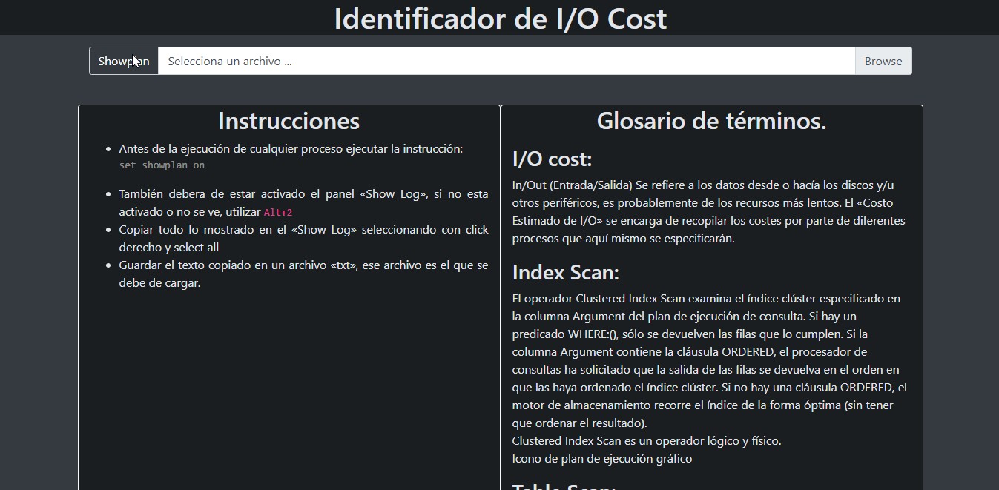

# IO_Cost Web App
---
Web app to validate the I/O cost  after running a Store Procedure in Sybase.

This web app is made to identify the line of the process in which it is consuming large readings/writings. The detailed instructions to obtain the show plan are detailed when opening the page.

## Instructions
Add the application to the server to be used and access it with the address corresponding to the `Index` page.

## Authors

- Jonathan Nicio <jNicioN@gmail.com>

